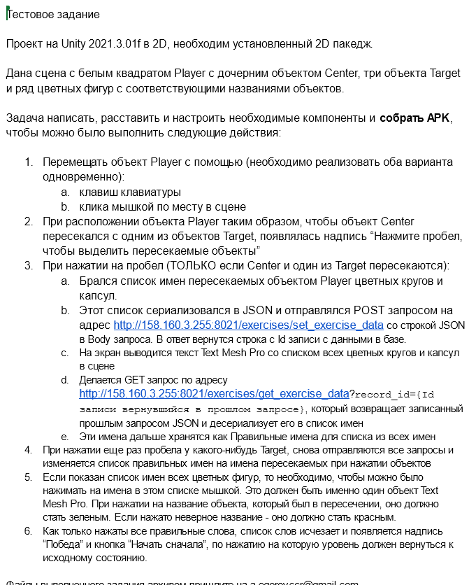

# Тестовое задание Avena

## Текст задания

[Исходная сцена задания](source_TestExercise.unity)

## Комментарии к реализации

Хотел похвалить сначала за насыщенность, но к концу, выполнение стало нудным. Кроме того, сервер не работает - протестировать, сеть не удалось. Хотя надо сказать, что довольно неплохое задание на движок.

Реализация простенькая, на стандартном рендере движка. В исходной сцене изменены слои для объектов и шейдеры для компонентов ShapeRenderer, остальное делает скрипт. APK собирается, не знаю только, как на телефоне будут нажимать пробел, по этому на аппарате не тестировал. На андроиде, на экран, могут рендериться текстуры детекции, но это поправимо. Математика реализована, но для рабочего использования не оформлена, это за деньги. На задание ушло два дня, учитывая поиски ответов на некоторые специальные вопросы, такие как решение пункта про TMPro, например.
